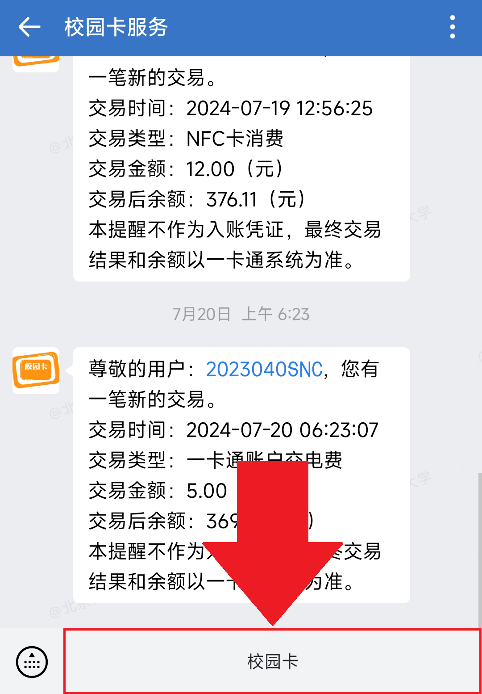
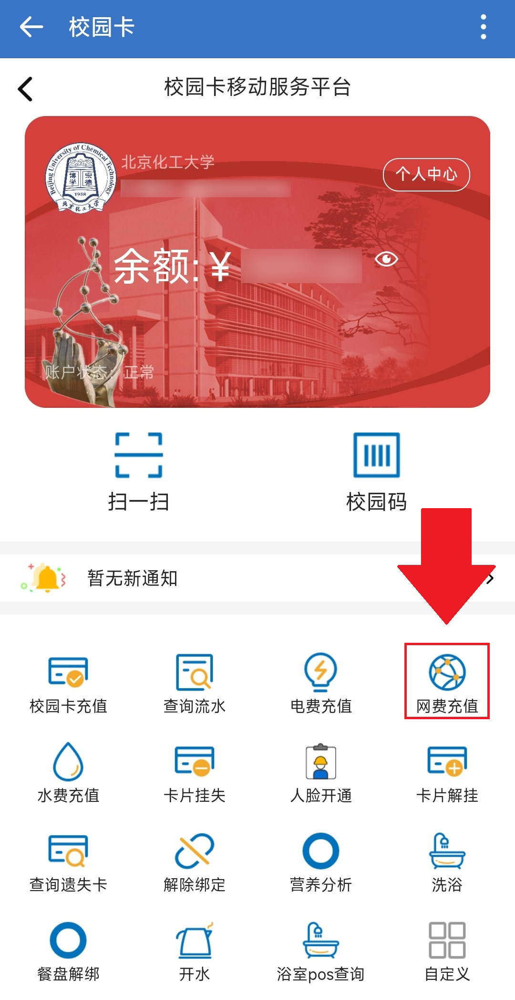

# 软件部分

## 搜索引擎

国内推荐[Bing必应搜索引擎](https://cn.bing.com)，某度广告多内容低质重复

如果计算机专业的学生遇到问题更推荐用**Google**，用**英文**在[StackOverflow](https://stackoverflow.com/)上找答案

对于有能力的同学：搜索教程类的建议是**官方文档**，尽量不要找CSDN等搬运，抄袭的内容。很容易出现内容过时，确实关键步骤等问题。

英文看不懂？推荐[**沉浸式翻译**](https://immersivetranslate.com/)浏览器插件

---

## AI

### 大陆

* [**DeepSeek** https://www.deepseek.com/](https://www.deepseek.com/)
* [通义千问 https://tongyi.aliyun.com/](https://tongyi.aliyun.com/)

### 海外

* ChatGPT（Copilot）
* Claude

---

## 软件红黑榜

### 浏览器

红榜：

* Edge
* Chrome
* Firefox

---

### 杀毒软件

拒绝：某60/某45/某讯/某毒霸等

原因：捆绑全家桶、广告弹窗不断，篡改浏览器主页

<ImageWithHint src="../../images/360_sample_screenshot.png" alt="某60广告弹窗" imgClass="h-60" class="w-fit m-auto" />

* Windows Defender
* 卡巴斯基

---

### 解压缩软件

拒绝：*压/**45压缩

原因：收费，广告弹窗

<ImageWithHint src="../../images/nanazip_screenshot.png" alt="NanaZip" imgClass="h-70" class="w-fit m-auto" />

* [7-Zip https://www.7-zip.org/](https://www.7-zip.org/)
* [NanaZip 微软应用商店](https://www.microsoft.com/store/productId/9N8G7TSCL18R)

---

### 输入法

#### 历史回顾

1. 某狗输入法绕过Windows锁屏高危漏洞:

    * [相关链接: 某狗输入法回应绕过Windows锁屏高危漏洞：已进行紧急修复](https://www.landiannews.com/archives/105257.html)
    * 时间: 2024年8月5日
2. 某狗输入法通过Windows 10/11原生通知系统投放网页游戏广告:

    * [相关链接: 更新 某狗输入法被发现通过Windows 10/11原生通知系统投放网页游戏广告](https://www.landiannews.com/archives/101557.html)
    * 时间: 2023年12月25日
3. 某狗输入法上传用户输入内容且加密系统可被监听:

    * [相关链接: 7年后某狗输入法依然存在严重问题 上传用户输入内容且加密系统可被监听](https://www.landiannews.com/archives/99829.html)
    * 时间: 2023年8月10日

---

4. 某狗输入法因侵害用户权益被网信办勒令下架:

* [相关链接: 因侵害用户权益被网信办勒令下架的某狗和某飞输入法已经恢复上架](https://www.landiannews.com/archives/89057.html)
* 时间: 2021年7月20日

5. 某狗输入法违规收集个人信息:

* [相关链接: 信息泄露知多少：网信办通报某狗/某度/某飞等输入法违规收集个人信息](https://www.landiannews.com/archives/87915.html)
* 时间: 2021年5月11日

6. 某狗输入法弹出618领红包广告:

* [相关链接: 任务栏疯狂弹出618领红包？放心你没中毒这是某狗输入法干的](https://www.landiannews.com/archives/75073.html)
* 时间: 2020年6月5日

7. 有些事情你记不得了，输入法还帮你记着:

* [相关链接: 有些事情你记不得了，输入法还帮你记着](https://www.landiannews.com/archives/22118.html)
* 时间: 2016年5月30日

8. 某狗输入法窃取用户数据并通过明文传输:

* [相关链接: McAfee曝某狗输入法窃取用户数据并通过明文传输](https://www.landiannews.com/archives/14132.html)
* 时间: 2015年1月20日

---

#### 如果确实不习惯微软词库少

推荐：[雾凇拼音方案（需要一些技术基础）](https://github.com/iDvel/rime-ice)

[教程-更好用的开源输入法：Rime + 雾凇拼音](https://zhuanlan.zhihu.com/p/676931217)

<ImageWithHint src="../../images/rime-ice.webp" alt="小狼毫雾凇拼音方案" imgClass="h-80" class="w-fit m-auto" />

---

## 专业软件

安装办公软件、制图软件、编程软件、数学及工程软件、影音软件

办公软件：

**Microsoft Office**

编程软件：

VC++、Dev-C++、**VScode**

影音软件：

Ps、Pr、Ae等其他软件

制图软件：

Inventor、AutoCAD、**SoilWorks**

数学及工程软件：

Maple、**Matlab**、Origin

---

## 学习辅助软件

* [Draw.io 微软应用商店](https://www.microsoft.com/store/productId/9MVVSZK43QQW)

  思维导图绘制

<ImageWithHint src="../../images/drawio_screenshot.png" alt="Draw.io" imgClass="h-85" class="w-fit m-auto" />

---
hideLogo: true
---

* [Geogebra https://www.geogebra.org](https://www.geogebra.org)

  类似几何画板，二维三维绘图

<ImageWithHint src="../../images/geogebra_screenshot.png" alt="Geogebra" imgClass="h-95" class="w-fit m-auto" />

---
hideLogo: true
---

* [Visual Studio Code 微软应用商店](https://apps.microsoft.com/store/detail/XP9KHM4BK9FZ7Q)

<ImageWithHint src="../../images/vscode_screenshot.png" alt="Visual Studio Code" imgClass="h-110" class="w-fit m-auto" />

---

## 远程串流

笔记本续航短，厚重，平板用不了大部分桌面软件？那么你需要远程串流！

* ToDesk（易用，不推荐）⭐️

  有限制时长，码率低帧率低
* **RDP（微软远程桌面）⭐️⭐️⭐️**

  电脑不需要额外下载软件，要求Windows专业版（不会升级可在每周X-ware服务升级）
* Sunshine+Moonlight⭐️⭐️⭐️⭐️

  码率最高，延迟低，支持手柄，可以远程串流游戏等体验与本地基本相同，配置较为复杂

---

## 校园生活

### 校园网

无线网络（100Mbps左右）：**BUCT**这个热点名在全校都有覆盖，教学楼和图书馆则是有**BUCT-JX**这个热点，连接之后可以**免费**使用。

有线（1000Mbps）：宿舍内提供千兆网线端口，可以使用符合RJ45标准的网线进行连接，通过墙上的网口连接后即可访问校园网进行登录操作。

#### 计费

除BUCT-JX网络外，其余网络均计费，标准为每月50GB免费流量，超出后0.0005元/MB（0.5元/GB），封顶60元（路由器共享）

#### 登录设备数

所有无线、有线设备加起来（包括免费的BUCT-JX）总共**三台**

---

#### 路由器

安装流程

1. 插上电源和网线(网线接路由器的那一端一定要接WAN口，如图所示)
<ImageWithHint src="../../images/WAN.png" alt="路由器WAN口" imgClass="h-60" class="w-fit m-auto" />

2. 连接未被初始化的Wi-Fi，然后会自动跳转成初始化的网页，进行初始化即可。日常使用5Ghz，或打开双频合一。

---

#### VPN

方式一：[网页VPN https://w.buct.edu.cn/](https://w.buct.edu.cn/)

方式二：[客户端VPN https://vpnmotion.buct.edu.cn/](https://vpnmotion.buct.edu.cn/)，内附使用方法

#### 校园网认证

[认证地址 https://tree.buct.edu.cn/](https://tree.buct.edu.cn/)

如果打不开尝试：
- [http://202.4.130.95/](http://202.4.130.95/) 
- [http://202.4.130.82/](http://202.4.130.82/)

---
layout: two-cols-header
---

#### 充值

1. 首先通过手机企业微信-工作台，进入校园卡服务，点击下方“校园卡”，进入图示界面，点击网费充值进行充值。

::left::

::right::

---
hideLogo: true
---

2. 然后通过校园网自服务平台来进行网费充值

<ImageWithHint src="../../images/campus_net_selfservice_screenshot.jpg" alt="校园网自服务平台" imgClass="h-110" class="w-fit m-auto" />

---

### NFC（仅限安卓）

学校NFC可以刷房门和食堂部分机器

<ImageWithHint src="../../images/NFC1.jpg" alt="1.下载北京一卡通" imgClass="h-80" class="w-fit m-auto" />
<ImageWithHint src="../../images/NFC2.jpg" alt="2.添加学生卡" imgClass="h-80" class="w-fit m-auto" />
<ImageWithHint src="../../images/NFC3.jpg" alt="3.添加成功" imgClass="h-80" class="w-fit m-auto" />
<ImageWithHint src="../../images/NFC4.jpg" alt="4.NFC模拟校园卡" imgClass="h-80" class="w-fit m-auto" />

---
layout: section
---

### 常用网站

---
logoPosition: top-right
---

#### [BUCT导航 https://buctsnc.cn](https://buctsnc.cn)

<ImageWithHint src="../../images/buctsnc_nav_screenshot.png" alt="BUCT导航" imgClass="h-100 m-4" class="w-fit m-auto" />
---

#### [BUCTBASE https://base.buctsnc.cn](https://base.buctsnc.cn)

<ImageWithHint src="../../images/buctbase_screenshot.png" alt="BUCT BASE" imgClass="h-100 m-4" class="w-fit m-auto" />

---
layout: two-cols-header
---

### X-ware

::left::

X-ware服务是学生网络中心为全校同学**义务**提供的电脑维修服务，至今已有20年的历史。主要工作包括：

- 提供电脑硬件升级建议
- 硬件故障排查
- 系统安装
- 软件安装
- 添加或更换硬盘、内存
- 清灰（包含硅脂）
- 网卡问题解决
- 硬盘清理
- 解决电脑蓝屏问题

::right::

<ImageWithHint src="../../images/X-ware.jpg" alt="添加内存" imgClass="h-90" class="w-fit m-auto" />

---
hideLogo: true
---

## **联系我们**

##

有疑问？

欢迎加入学生网络中心X-ware服务群！无论遇到什么问题，都可以在群内提问，或者私聊管理员进行一对一解答。

仍有问题？

关注“**学生网络中心**”公众号，预约X-ware服务。**每周五晚**，我们在**后勤楼319**提供X-ware志愿服务，解决您的一切硬件和软件问题，竭诚为您服务。

X-ware，跨越硬件与软件的桥梁！

  <QRCodeWithHint
  :width="160"
  type="canvas"
  data="https://qm.qq.com/q/aCF3RIFxxS"
  :imageOptions="{ margin: 10 }"
  :dotsOptions="{ type: 'extra-rounded'}"
  hint="X-ware服务群1"
/>
  <QRCodeWithHint
  :width="160"
  type="canvas"
  data="https://qm.qq.com/q/qv9AmYmHBg"
  :imageOptions="{ margin: 10 }"
  :dotsOptions="{ type: 'extra-rounded'}"
  hint="X-ware服务群2"
/>
<QRCodeWithHint
  :width="160"
  type="canvas"
  data="http://weixin.qq.com/r/TUyuq3DEtbjJKDTIbxnJ"
  :imageOptions="{ margin: 10 }"
  :dotsOptions="{ type: 'extra-rounded'}"
  hint="学生网络中心公众号"
/>

